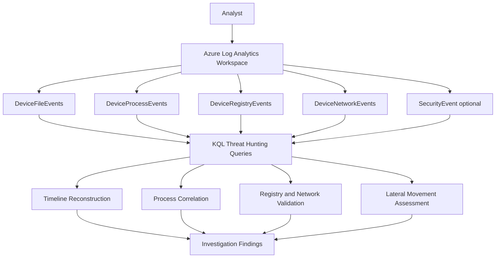
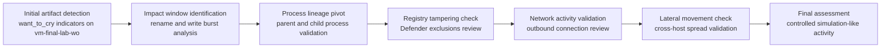

# Wannacry Investigation Report

Investigating **simulated ransomware-like activity** using **KQL** in an **Azure Log Analytics Workspace**.

This repository combines a SOC-style incident report with a step-by-step threat hunting walkthrough. It focuses on artifacts containing `want_to_cry` (including file names ending with `.want_to_cry`) to show how analysts validate impact, build timelines, and check for lateral movement.

> **Scope:** Single host `vm-final-lab-wo`  
> **Conclusion:** Ransomware-like simulation (controlled artifacts and no validated lateral movement)

## Skills Demonstrated

- Threat hunting with KQL
- Log analysis in Azure Log Analytics
- File, process, registry, and network event correlation
- Lateral movement validation
- MITRE ATT&CK behavior mapping
- Incident response documentation and evidence packaging

## Investigation Architecture

## Investigation Timeline

For evidence-driven timing details, see [report/investigation_timeline.md](report/investigation_timeline.md).

## Investigation Walkthrough

Follow the walkthrough in order:

1. [walkthrough/01_initial_triage.md](walkthrough/01_initial_triage.md)
2. [walkthrough/02_identifying_encryption_activity.md](walkthrough/02_identifying_encryption_activity.md)
3. [walkthrough/03_process_investigation.md](walkthrough/03_process_investigation.md)
4. [walkthrough/04_registry_analysis.md](walkthrough/04_registry_analysis.md)
5. [walkthrough/05_network_activity.md](walkthrough/05_network_activity.md)
6. [walkthrough/06_conclusion.md](walkthrough/06_conclusion.md)

Core KQL sequence:

1. `kql_queries/01_find_want_to_cry_files.kql`
2. `kql_queries/02_encryption_start_time.kql`
3. `kql_queries/03_file_activity_by_process.kql`
4. `kql_queries/06_defender_exclusions_paths.kql`
5. `kql_queries/08_lateral_movement_check.kql`

## Key Investigation Takeaways

- Suspicious artifacts containing `want_to_cry` were identified on `vm-final-lab-wo`.
- Activity remained bounded to a single host and a narrow time window.
- Process and registry pivots supported simulation-like behavior over active outbreak conditions.
- Network validation did not show strong indicators of active command-and-control.
- No validated evidence of lateral movement was found in scope.

## MITRE ATT&CK Mapping

See [mitre_mapping/mitre_attack_mapping.md](mitre_mapping/mitre_attack_mapping.md) for educational mappings tied to investigation evidence.

## Reproducing the Investigation

1. Open Azure Log Analytics Workspace and go to **Logs**.
2. Run `kql_queries/01_find_want_to_cry_files.kql`.
   Checkpoint: Confirm `want_to_cry` artifacts exist and scope host is `vm-final-lab-wo`.
3. Run `kql_queries/02_encryption_start_time.kql`.
   Checkpoint: Identify earliest impact signal and candidate impact window.
4. Run `kql_queries/03_file_activity_by_process.kql`.
   Checkpoint: Correlate file activity to responsible process context.
5. Run `kql_queries/06_defender_exclusions_paths.kql`.
   Checkpoint: Determine whether Defender exclusions indicate likely defense evasion.
6. Run `kql_queries/08_lateral_movement_check.kql`.
   Checkpoint: Validate whether spread occurred beyond the single host.
7. Build your final timeline and findings using `TimeGenerated` as the canonical timestamp field.

## Query Output Examples

Investigation screenshot slots are defined below. Current status: **pending capture**.

- `images/kql_query_results_1_find_want_to_cry.png`
- `images/kql_query_results_2_process_investigation.png`
- `images/kql_query_results_3_registry_exclusions.png`
- `images/kql_query_results_4_network_validation.png`

Capture guidance is documented in [images/README.md](images/README.md).

## Repository Map

- `report/` - incident-style write-up (summary, timeline, findings, recommendations)
- `walkthrough/` - guided investigation workflow (triage to conclusion)
- `kql_queries/` - ready-to-run hunting and validation queries
- `mitre_mapping/` - MITRE ATT&CK educational mapping
- `artifacts/` - artifact list focused on `want_to_cry` strings
- `images/` - screenshot naming contract and capture guidance

