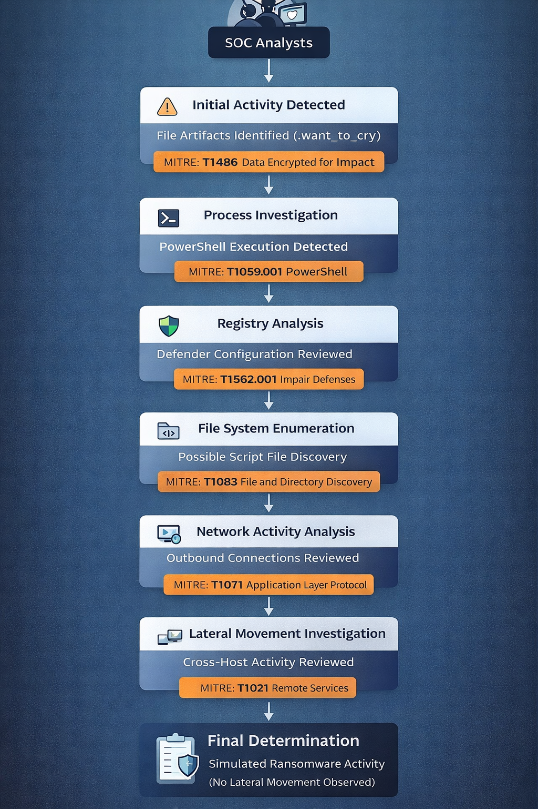

<<<<<<< HEAD

# MITRE ATT&CK Mapping (Educational)

> This mapping is derived from the **KQL queries used in the investigation** and reflects attacker techniques that were investigated during the ransomware-like activity.
> The purpose of this mapping is educational — demonstrating how security analysts relate observed behaviors to the MITRE ATT&CK framework.

| Tactic                                 | Technique                                | Why it may apply                                                                                                                                        | Evidence to cite                                                                                   |
| -------------------------------------- | ---------------------------------------- | ------------------------------------------------------------------------------------------------------------------------------------------------------- | -------------------------------------------------------------------------------------------------- |
| **Impact**                             | **T1486 – Data Encrypted for Impact**    | Files renamed with `.want_to_cry`, indicating simulated encryption behavior typical of ransomware operations.                                           | `DeviceFileEvents` query identifying `.want_to_cry` artifacts and rename/write activity.           |
| **Execution**                          | **T1059.001 – PowerShell**               | PowerShell execution was observed during the investigation window, potentially used to execute scripts or automate file modifications.                  | `DeviceProcessEvents` query identifying `powershell.exe` activity with command line parameters.    |
| **Defense Evasion**                    | **T1562.001 – Impair Defenses**          | Ransomware often disables or bypasses security tools by modifying Windows Defender configuration or exclusions.                                         | `DeviceRegistryEvents` queries reviewing keys under `Microsoft\Windows Defender\Exclusions\Paths`. |
| **Discovery**                          | **T1083 – File and Directory Discovery** | Ransomware typically enumerates local files before encryption or renaming operations. Script activity may access directories prior to the rename burst. | Process analysis using `DeviceProcessEvents` queries related to suspicious activity.               |
| **Defense Evasion**                    | **T1036 – Masquerading**                 | Files renamed with `.want_to_cry` mimic the naming convention of known ransomware families such as WannaCry.                                            | `DeviceFileEvents` identifying artifacts like `Install.ps1.want_to_cry`.                           |
| **Command and Control (Investigated)** | **T1071 – Application Layer Protocol**   | Investigation included validation of outbound network communication during the suspected impact window.                                                 | `DeviceNetworkEvents` query summarizing remote connections by `RemoteIP`.                          |
| **Lateral Movement (Investigated)**    | **T1021 – Remote Services**              | Analysts reviewed authentication logs and cross-host activity to determine whether the activity spread to other systems.                                | `SecurityEvent` queries and cross-host artifact searches.                                          |
| **Credential Access (Investigated)**   | **T1552 – Unsecured Credentials**        | Authentication activity was analyzed to detect potential credential misuse during the investigation window.                                             | `SecurityEvent` review of authentication events (4624 / 4625).                                     |

---

# Investigation Conclusion

The investigation determined that while several behaviors aligned with common ransomware techniques — including PowerShell execution, file renaming patterns, and potential defense evasion checks — the activity was consistent with a **controlled ransomware simulation** rather than a confirmed malicious compromise.

Key indicators supporting this conclusion include:

* Artifacts intentionally labeled with the string **`want_to_cry`**
* Activity limited to a **single host (`vm-final-lab-wo`)**
* No evidence of **lateral movement**
* No confirmed **command-and-control communication**

This investigation demonstrates how analysts can apply MITRE ATT&CK mapping during threat hunting and incident response to better understand attacker behavior and validate the scope of potential compromise.

---

## MITRE ATT&CK Attack Flow

The following diagram illustrates the **investigation workflow and related MITRE techniques** identified during the ransomware-like activity.



```
Initial Activity Detected
        │
        ▼
File Artifacts Identified (.want_to_cry)
MITRE: T1486 – Data Encrypted for Impact
        │
        ▼
Process Investigation
PowerShell Execution Detected
MITRE: T1059.001 – PowerShell
        │
        ▼
Registry Analysis
Defender Configuration Reviewed
MITRE: T1562.001 – Impair Defenses
        │
        ▼
File System Enumeration
Possible Script File Discovery
MITRE: T1083 – File and Directory Discovery
        │
        ▼
Network Activity Analysis
Outbound Connections Reviewed
MITRE: T1071 – Application Layer Protocol
        │
        ▼
Lateral Movement Investigation
Cross-Host Activity Reviewed
MITRE: T1021 – Remote Services
        │
        ▼
Final Determination
Simulated Ransomware Activity
(No Lateral Movement Observed)
```

---

=======
# MITRE ATT&CK Mapping (Educational)

> This is a learning-oriented mapping of observed investigation themes.  
> Confirm techniques based on actual evidence in your environment.

| Tactic | Technique | Why it may apply | Evidence to cite |
|---|---|---|---|
| Impact | T1486 Data Encrypted for Impact | File rename/encryption-like activity | DeviceFileEvents rename/write bursts |
| Execution | T1059.001 PowerShell | PowerShell-based activity | DeviceProcessEvents (powershell.exe) |
| Defense Evasion | T1562.001 Impair Defenses | Defender exclusions/tampering | DeviceRegistryEvents under Defender keys |
| Discovery | T1083 File and Directory Discovery | Scripts enumerating files before rename | Process command line / script content |
| Lateral Movement | (various) | Checked and not proven | SecurityEvent + process/network pivots |
>>>>>>> 1df114c79c3aafb7dd68fc8298645fa88fc314e5
