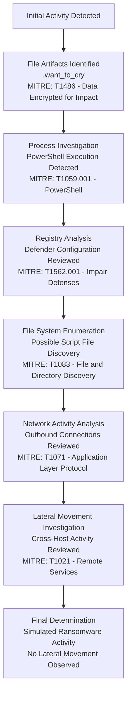

# MITRE ATT&CK Mapping (Educational)

> This is a learning-oriented mapping of observed investigation themes.
> Confirm techniques based on actual evidence in your environment.

| Tactic | Technique | Why it may apply | Evidence to cite |
|---|---|---|---|
| Impact | T1486 Data Encrypted for Impact | File rename/encryption-like activity | DeviceFileEvents rename/write bursts |
| Execution | T1059.001 PowerShell | PowerShell-based activity | DeviceProcessEvents (powershell.exe) |
| Defense Evasion | T1562.001 Impair Defenses | Defender exclusions or tampering checks | DeviceRegistryEvents under Defender keys |
| Discovery | T1083 File and Directory Discovery | Scripts enumerating files before rename | Process command line or script content |
| Command and Control (Investigated) | T1071 Application Layer Protocol | Outbound communications were reviewed during impact window | DeviceNetworkEvents remote connection pivots |
| Lateral Movement (Investigated) | T1021 Remote Services | Cross-host spread was investigated | SecurityEvent plus process and network pivots |

# Attack Flow Diagram

The following diagram illustrates the investigation workflow and related MITRE techniques identified during the ransomware-like activity.

